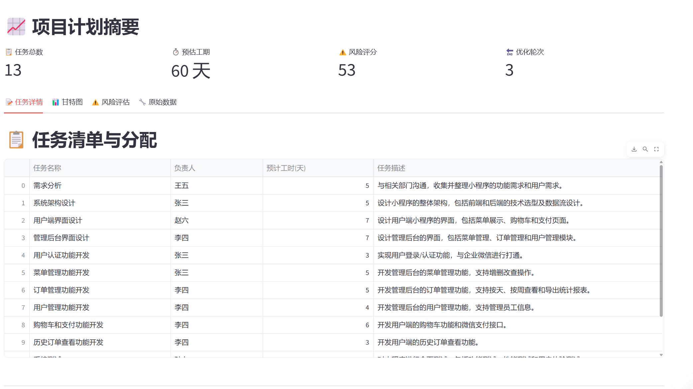
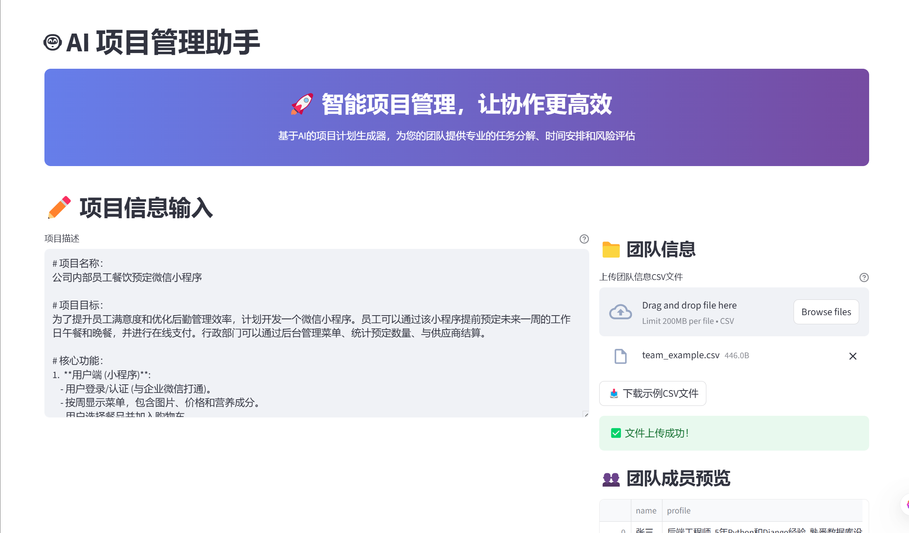

# Project Manager AI

<details>
<summary><strong>:us: English Version</strong></summary>

> Your intelligent co-pilot for seamless project planning and execution. This tool leverages Large Language Models (LLMs) to transform a simple project description into a comprehensive, actionable plan, complete with tasks, dependencies, schedules, and risk assessments.

[](https://travis-ci.org/your_username/your_repository)
[](https://opensource.org/licenses/MIT)
[](https://www.python.org/downloads/)

---

### Final Plan Output

*<p align="center">An example of the final project plan generated by the AI.</p>*

## ✨ Key Features

*   **🤖 AI-Powered Task Generation**: Automatically decomposes high-level project goals into detailed, granular tasks.
*   **🔗 Automated Dependency Analysis**: Intelligently identifies and maps dependencies between tasks to create an optimal workflow.
*   **📊 Dynamic Gantt Chart Visualization**: Generates interactive Gantt charts for a clear view of the project timeline.
*   **👥 Team-Aware Planning**: Allocates tasks based on real team members' skills and profiles, leading to more accurate effort estimation.
*   **⚠️ Proactive Risk Assessment**: Identifies potential risks in the project plan and suggests mitigation strategies.
*   **🔌 Pluggable Architecture**: Easily extend the system with new integrations (e.g., Jira, Asana, Slack) without touching the core logic.

## 🚀 Quick Start

Get your local instance of Project Manager AI up and running in minutes.

### Project & Team Input

*<p align="center">Simply provide a project description and your team's profile.</p>*

### 1. Clone the Repository

```bash
git clone https://github.com/your_username/project-manager-assistant.git
cd project-manager-assistant
```

### 2. Install Dependencies

It's recommended to use a virtual environment.

```bash
python -m venv venv
source venv/bin/activate  # On Windows, use `venv\Scripts\activate`
pip install -r requirements.txt
```

### 3. Configure Environment

Copy the example environment file and fill in your details, especially your OpenAI API key.

```bash
cp .env.example .env
# Now, open .env and add your credentials
# OPENAI_API_KEY="sk-..."
```

### 4. Run the Application

The backend server and the frontend UI run as separate processes.

**Run the Backend (FastAPI):**
```bash
uvicorn app.main:app --reload
```

**Run the Frontend (Streamlit):**
```bash
streamlit run streamlit_app/app.py
```

Now, open your browser to `http://localhost:8501` to start planning!

## 🛠️ Architecture Overview

This project is built on a powerful and flexible pluggable architecture, powered by **LangGraph**.

*   **Core Engine**: A sophisticated agentic workflow that handles the core logic of planning, analysis, and optimization.
*   **Plugins**: All external integrations (like exporting to Jira or sending Slack notifications) are designed as independent plugins. This allows for easy extension and customization without modifying the core system.

This design makes the platform highly extensible and robust. To learn more about how to develop your own plugin, see our `CONTRIBUTING.md` guide.

## 🤝 How to Contribute

We welcome contributions of all kinds! Whether it's reporting a bug, submitting a feature request, or writing code for a new plugin, your help is greatly appreciated.

Please read our **[Contributing Guide](CONTRIBUTING.md)** to get started.

## 📄 License

This project is licensed under the MIT License. See the [LICENSE](LICENSE) file for details.

</details>

<details>
<summary><strong>:cn: 中文版本</strong></summary>

> 您的智能项目管理助手，助力实现无缝的项目规划与执行。本工具利用大型语言模型（LLM），将简单的项目描述转化为详尽、可执行的计划，涵盖任务分解、依赖分析、时间排期和风险评估。

[](https://travis-ci.org/your_username/your_repository)
[](https://opensource.org/licenses/MIT)
[](https://www.python.org/downloads/)

---

### 项目计划成果

*<p align="center">由AI生成的最终项目计划示例。</p>*

## ✨ 核心功能

*   **🤖 AI智能任务生成**: 自动将高层级的项目目标分解为详细、具体的可执行任务。
*   **🔗 自动化依赖分析**: 智能识别并映射任务间的依赖关系，构建最优工作流。
*   **📊 动态甘特图可视化**: 生成交互式甘特图，清晰展示项目时间线。
*   **👥 感知团队的规划能力**: 基于真实团队成员的技能画像进行任务分配，从而实现更精准的工时估算。
*   **⚠️ 前瞻性风险评估**: 识别项目计划中的潜在风险，并提出缓解策略。
*   **🔌 拔插式插件架构**: 无需修改核心代码，即可轻松通过插件扩展新功能（如集成Jira, Asana, Slack）。

## 🚀 快速上手

在几分钟内启动并运行您的本地项目管理AI实例。

### 项目与团队信息输入

*<p align="center">您只需提供项目描述和团队成员简介。</p>*

### 1. 克隆代码仓库

```bash
git clone https://github.com/your_username/project-manager-assistant.git
cd project-manager-assistant
```

### 2. 安装依赖

推荐使用Python虚拟环境。

```bash
python -m venv venv
source venv/bin/activate  # Windows系统请使用 `venv\Scripts\activate`
pip install -r requirements.txt
```

### 3. 配置环境变量

复制环境文件示例，并填入您的信息，特别是您的OpenAI API密钥。

```bash
cp .env.example .env
# 打开 .env 文件并填入您的凭证
# OPENAI_API_KEY="sk-..."
```

### 4. 运行应用

后端服务器与前端界面作为两个独立的进程运行。

**运行后端 (FastAPI):**
```bash
uvicorn app.main:app --reload
```

**运行前端 (Streamlit):**
```bash
streamlit run streamlit_app/app.py
```

现在，在浏览器中打开 `http://localhost:8501`，开始您的智能项目规划之旅！

## 🛠️ 架构概览

本项目构建于一个强大且灵活的**拔插式插件架构**之上，由 **LangGraph** 驱动。

*   **核心引擎**: 一个复杂的Agent工作流，负责处理规划、分析与优化的核心逻辑。
*   **插件 (Plugins)**: 所有的外部系统集成（如导出到Jira或发送Slack通知）都被设计为独立的插件。这使得在不修改核心系统的情况下，可以轻松地进行扩展和定制。

这种设计使得平台具有高度的可扩展性和健壮性。想了解如何开发您自己的插件，请阅读我们的 `CONTRIBUTING.md` 指南。

## 🤝 如何贡献

我们欢迎任何形式的贡献！无论是报告一个bug、提交一个功能请求，还是为一个新插件编写代码，我们都非常感谢您的帮助。

在开始之前，请阅读我们的 **[贡献指南](CONTRIBUTING.md)**。

## 📄 许可证

本项目采用MIT许可证。详情请见 [LICENSE](LICENSE) 文件。

</details>
