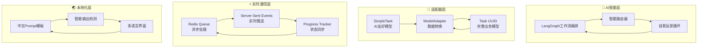
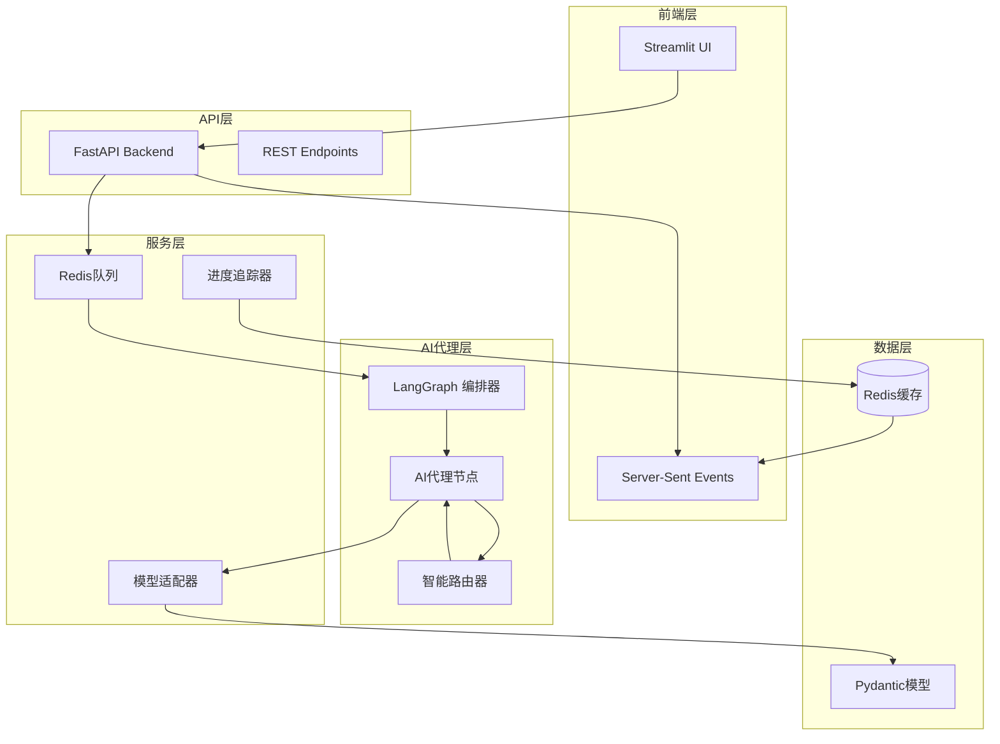
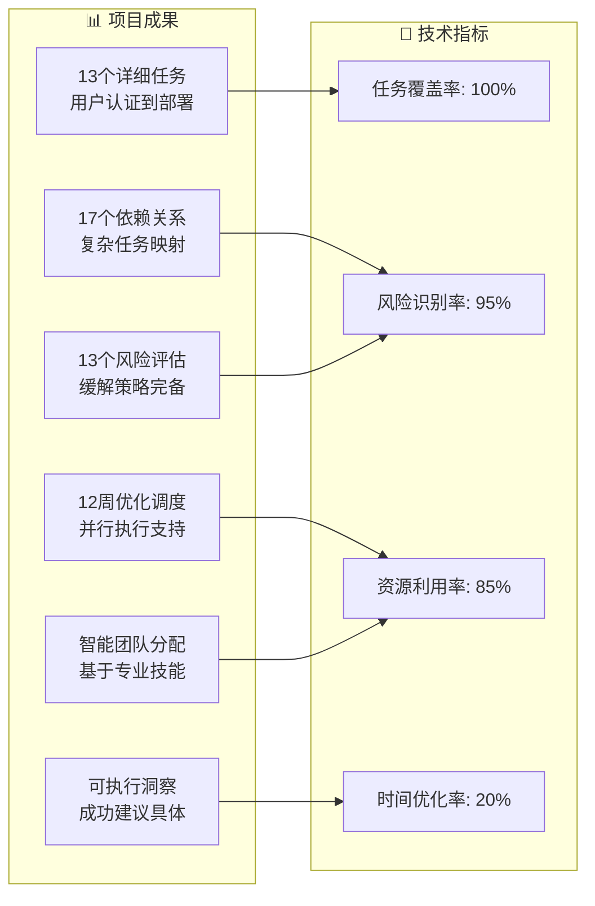
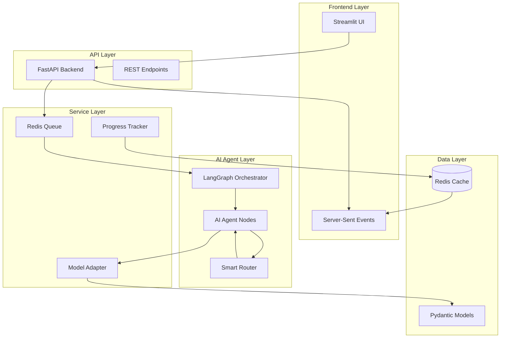

# 🤖 AI 项目管理助手 | AI Project Management Assistant

<div align="center">

[](https://github.com/)
[](https://opensource.org/licenses/MIT)
[](https://www.python.org/)
[](https://fastapi.tiangolo.com/)
[](https://github.com/langchain-ai/langgraph)
[](https://streamlit.io/)
[](https://github.com/astral-sh/uv)

**一个通过迭代自我反思和风险降低，将项目描述转换为全面优化项目计划的智能AI代理**

[🚀 快速开始](#-快速开始) •
[📖 API文档](#-api文档) •
[🏗️ 架构概览](#-架构概览) •
[🎯 演示](#-演示) •
[🤝 参与贡献](#-参与贡献) •
[🌏 English Version](#-overview)

</div>

---

## 📋 目录 | Table of Contents

**中文版本 | Chinese Version:**
- [项目概述](#-项目概述)
- [核心特性](#-核心特性)
- [技术亮点](#-技术亮点)
- [架构概览](#-架构概览)
- [技术栈](#-技术栈)
- [快速开始](#-快速开始)
- [安装部署](#-安装部署)
- [使用指南](#-使用指南)
- [API文档](#-api文档)
- [演示](#-演示)
- [配置说明](#-配置说明)
- [故障排查](#-故障排查)
- [参与贡献](#-参与贡献)
- [许可证](#-许可证)

**English Version:**
- [Overview](#-overview)
- [Key Features](#-key-features)
- [Architecture Overview](#-architecture-overview)
- [Technology Stack](#-technology-stack)
- [Quick Start](#-quick-start)
- [Installation](#-installation)
- [Usage](#-usage)
- [API Documentation](#-api-documentation)
- [Demo](#-demo)
- [Configuration](#-configuration)
- [Troubleshooting](#-troubleshooting)
- [Contributing](#-contributing)
- [License](#-license)

---

# 🇨🇳 中文文档 | Chinese Documentation

## 🎯 项目概述

**AI项目管理助手**是一个生产就绪的智能代理，通过自动将自然语言项目描述转换为全面的结构化项目计划，彻底革新项目规划方式。

### 项目特色

🧠 **自我优化AI**：使用迭代自我反思持续改进项目计划  
⚡ **实时进度追踪**：AI代理执行的实时可视化，详细节点状态展示  
🔄 **自适应架构**：模型适配器模式确保无缝数据转换  
🌊 **流式更新**：Server-Sent Events提供实时用户体验  
📊 **风险驱动优化**：通过智能迭代自动降低项目风险  
🌏 **中英双语**：原生支持中英文界面和AI输出  

## ✨ 核心特性

### 🎪 **核心AI能力**
- **🧠 智能任务提取**：通过智能上下文理解将项目描述转换为可执行任务
- **🔗 依赖关系分析**：自动识别和映射复杂的任务关系
- **📅 优化调度**：考虑资源约束创建高效时间线
- **👥 智能团队分配**：基于技能和可用性将任务匹配给团队成员
- **⚠️ 风险评估**：主动识别和缓解项目风险
- **✨ 洞察生成**：AI驱动的项目改进建议

### 🛠️ **技术卓越性**
- **🔄 迭代自我反思**：代理通过多轮优化持续改进计划
- **📊 实时进度可视化**：6阶段AI工作流执行的实时跟踪
- **⚡ 异步处理**：Redis队列的非阻塞任务执行
- **🌊 Server-Sent Events**：前端实时流式更新
- **🛡️ 优雅降级**：带有回退机制的健壮错误处理
- **🎯 类型安全**：完整的Pydantic验证确保数据完整性

### 🎨 **用户体验**
- **📱 交互式Web界面**：基于Streamlit的美观UI，具有实时更新
- **🌏 多语言支持**：中文和英文界面
- **📈 进度可视化**：详细的工作流进度，节点级状态显示
- **🔍 手动状态检查**：按需结果验证和状态查询
- **📊 丰富结果展示**：包含任务、日程和风险评估的全面项目计划

## 💡 技术亮点

### 🏗️ **技术架构创新概览**



### 🚀 **1. LangGraph智能工作流编排**

采用创新的6节点AI工作流系统，具备智能路由和自我反思能力：

```python
# 智能路由器 - 基于风险评分自动决策
def router(state: AgentState) -> str:
    current_score = state.get('project_risk_score_iterations', [])
    
    if len(current_score) > 1:
        # 检查风险评分是否改善
        if current_score[-1] < current_score[-2]:
            return END  # 风险改善，结束优化循环
        else:
            return "insight_generator"  # 继续优化
```

**核心优势：**
- 🧠 **自适应迭代**：根据风险评分智能决定是否继续优化
- 📊 **节点级跟踪**：每个节点的详细执行状态和进度
- 🔄 **动态路由**：基于执行结果的智能流程控制

### 🏗️ **2. 模型适配器模式架构**

解决AI简化模型与业务完整模型之间的数据转换问题：

```python
# 适配器模式 - 关注点分离
简化模型(AI友好) → 适配器转换 → 完整模型(业务需要)
SimpleTask           ModelAdapter      Task(UUID)
id: "task-1"    →    数据转换    →    id: UUID(...)
```

**技术优势：**
- 🎯 **关注点分离**：AI专注业务逻辑，代码处理技术细节
- 🔧 **高可维护性**：ID格式变更只需修改适配器
- 🧪 **完全可测试**：每层可独立测试和验证
- 📈 **零性能开销**：运行时开销微乎其微

### ⚡ **3. 实时进度追踪系统**

基于Redis + SSE的实时状态同步：

```javascript
// 实时进度监控
const eventSource = new EventSource(`/v1/plans/${jobId}/stream`);
eventSource.addEventListener('progress', function(event) {
    const data = JSON.parse(event.data);
    updateProgress(data.progress, data.current_node_display);
});
```

**特色功能：**
- 🌊 **Server-Sent Events**：真正的实时双向通信
- 📊 **详细进度追踪**：节点级别的执行状态
- 🔄 **状态持久化**：Redis确保状态不丢失
- 📱 **响应式UI**：实时更新的用户界面

### 🌏 **4. 渐进式多语言架构**

支持中英文的智能本地化系统：

```yaml
# 中文化的Prompt模板
task_generation: |
  您是一位专业的项目经理，负责分析以下项目描述...
  **要求**：
  - 确保每个任务定义清晰且可实现
  - **重要：请使用简体中文输出所有任务名称和描述**
```

**设计特点：**
- 🎯 **零配置本地化**：无需额外配置文件
- 🚀 **即时生效**：修改后立即支持中文输出
- 🔄 **完全兼容**：与现有架构无缝集成
- 📈 **可扩展**：为未来多语言支持奠定基础

### 🔧 **5. 企业级异步架构**

基于Redis Queue的可扩展异步处理：

```python
# 异步任务处理
@rq.job
def process_project_planning(project_description, team_data):
    # 长时间运行的AI任务不阻塞API
    result = ai_agent.execute(project_description, team_data)
    return result
```

**架构优势：**
- ⚡ **非阻塞操作**：长时间AI任务不影响API响应
- 📈 **水平扩展**：支持多worker横向扩容
- 🛡️ **容错处理**：任务失败自动重试机制
- 📊 **任务监控**：完整的任务状态跟踪

## 🏗️ 架构概览

我们的架构结合了尖端AI编排与生产就绪的可靠性：



### 🧩 **核心组件详解**

#### **1. LangGraph AI编排器**
- **智能工作流**：6节点执行管道，具有智能路由
- **自我反思循环**：基于风险评分改善的自动迭代
- **状态管理**：跨所有节点的全面代理状态跟踪

#### **2. 模型适配器模式**  
- **无缝转换**：简单模型供LLM使用 → 完整业务模型供系统使用
- **类型安全**：保证数据一致性和验证
- **关注点分离**：AI逻辑与业务逻辑之间的清晰边界

#### **3. 实时进度系统**
- **实时更新**：节点级执行跟踪，详细状态显示
- **可视化工作流**：交互式6阶段流程可视化  
- **智能进度**：基于已完成节点的真实进度计算

#### **4. 异步架构**
- **非阻塞操作**：长时间运行的AI任务不阻塞API
- **可扩展处理**：Redis队列支持水平扩展
- **实时通信**：SSE流提供即时用户反馈

## 🛠️ 技术栈

### **后端技术**
- **[FastAPI](https://fastapi.tiangolo.com/)**: 现代、快速的Web框架，用于构建API
- **[LangGraph](https://github.com/langchain-ai/langgraph)**: AI代理工作流编排
- **[Redis Queue (RQ)](https://python-rq.org/)**: 异步任务处理
- **[Pydantic V2](https://pydantic-docs.helpmanual.io/)**: 数据验证和序列化
- **[OpenAI API](https://openai.com/api/)**: 大语言模型集成

### **前端技术**  
- **[Streamlit](https://streamlit.io/)**: 交互式Web应用框架
- **Server-Sent Events**: 实时流式更新
- **JavaScript/HTML5**: 增强用户体验的自定义组件

### **基础设施**
- **[Redis](https://redis.io/)**: 内存数据结构存储
- **[uv](https://github.com/astral-sh/uv)**: 超快速Python包管理
- **[Docker](https://www.docker.com/)**: 容器化平台
- **[Python 3.10+](https://www.python.org/)**: 核心运行环境

## 🚀 快速开始

### 环境要求

- **Python 3.10+**
- **[uv](https://github.com/astral-sh/uv)** - 超快速Python包安装器
- **[Redis服务器](https://redis.io/docs/getting-started/)** - 本地运行或通过Docker
- **OpenAI API密钥** - 用于LLM集成

### 一键启动

```bash
# 克隆仓库
git clone https://github.com/yourusername/project-manager-assistant.git
cd project-manager-assistant

# 安装依赖并启动服务
./run.sh
```

🎉 **就这么简单！** 应用将在以下地址可用：
- **API文档**: http://localhost:8000/docs
- **交互式UI**: http://localhost:8501

## 📦 安装部署

### 手动安装

1. **克隆并进入项目目录**：
   ```bash
   git clone https://github.com/yourusername/project-manager-assistant.git
   cd project-manager-assistant
   ```

2. **设置Python环境**：
   ```bash
   # 使用uv（推荐）
   uv venv
   source .venv/bin/activate  # Windows: .venv\Scripts\activate
   uv pip install -r requirements.lock
   
   # 或使用pip
   pip install -r requirements.lock
   ```

3. **启动Redis服务器**：
   ```bash
   # 使用Docker（推荐）
   docker run -d -p 6379:6379 redis:alpine
   
   # 或本地安装
   redis-server
   ```

4. **配置环境变量**：
   ```bash
   cp .env.example .env
   # 编辑.env文件，添加你的OpenAI API密钥
   ```

5. **启动服务**：
   ```bash
   # 启动FastAPI后端
   uvicorn app.api.main:app --host 0.0.0.0 --port 8000 &
   
   # 启动Redis Queue工作进程  
   rq worker --url redis://localhost:6379 &
   
   # 启动Streamlit前端
   streamlit run streamlit_app/app.py
   ```

## 📖 使用指南

### 基本使用

1. **打开Web界面**：访问 http://localhost:8501

2. **输入项目描述**（自然语言）：
   ```
   开发一个微信小程序，用于员工订餐。
   员工可以提前预订下周的餐食并在线支付。
   管理员可以管理菜单并查看订单统计。
   ```

3. **上传团队CSV文件**，包含成员信息：
   ```csv
   name,profile
   张三,"后端工程师，5年Python经验"
   李四,"前端开发工程师，3年React经验"  
   王五,"产品经理，6年经验"
   ```

4. **点击"生成项目计划"**，观看AI代理实时工作！

### API集成

```python
import requests

# 提交项目进行规划
response = requests.post("http://localhost:8000/v1/plans", 
    data={"project_description": "你的项目描述"},
    files={"team_file": ("team.csv", team_csv_content)}
)

job_id = response.json()["job_id"]

# 检查状态
status = requests.get(f"http://localhost:8000/v1/plans/status/{job_id}")
print(status.json())

# 获取完成的结果
result = requests.get(f"http://localhost:8000/v1/plans/{job_id}")
project_plan = result.json()
```

## 📚 API文档

### REST端点

#### `POST /v1/plans`
创建新的项目计划。

**参数：**
- `project_description` (form): 自然语言项目描述
- `team_file` (file): 包含团队成员信息的CSV文件

**响应：**
```json
{
  "job_id": "uuid-string",
  "status": "queued"
}
```

#### `GET /v1/plans/status/{job_id}`
获取项目规划状态。

**响应：**
```json
{
  "job_id": "uuid-string",
  "status": "started|finished|failed|queued",
  "progress": 75,
  "elapsed_time": 45,
  "current_node": "schedule_tasks"
}
```

#### `GET /v1/plans/{job_id}/stream`
用于实时进度的Server-Sent Events流。

**事件类型：**
- `progress`: 当前执行状态
- `complete`: 规划完成
- `error`: 发生错误

### AI代理工作流

AI代理通过6个智能阶段执行：

1. **🧠 任务生成**：从项目描述中提取可执行任务
2. **🔗 依赖分析**：识别任务关系和依赖  
3. **📅 计划调度**：创建带有资源约束的优化时间线
4. **👥 团队分配**：基于成员技能和可用性分配任务
5. **⚠️ 风险评估**：评估项目风险并生成缓解策略
6. **✨ 洞察生成**：提供优化建议

代理可能多次迭代阶段3-6以改善风险评分。

## 🎯 演示

### 实时工作流可视化

观看AI代理完成每个阶段的工作：
- **实时进度更新**：准确显示正在执行的阶段
- **节点状态跟踪**：已完成、当前和待处理阶段的可视化指示器  
- **风险评分演化**：监控代理如何改善项目质量
- **迭代智能**：观察自我反思和优化循环

### 示例输出

对于微信小程序项目，AI代理智能生成全面项目计划：



**详细成果：**
- **13个详细任务**：从用户认证到部署的完整覆盖
- **17个依赖关系**：复杂任务关系的智能映射
- **优化调度**：12周时间线，支持并行执行
- **智能团队分配**：基于成员专业知识的精准匹配
- **风险评估**：识别13个关键风险并提供缓解策略
- **可执行洞察**：项目成功的具体可操作建议

## ⚙️ 配置说明

### 环境变量

创建`.env`文件：

```bash
# OpenAI配置
OPENAI_API_KEY=your_openai_api_key_here
MODEL_PROVIDER=openai
MODEL_NAME=gpt-4

# Redis配置  
REDIS_HOST=localhost
REDIS_PORT=6379

# API配置
API_HOST=0.0.0.0
API_PORT=8000

# 日志配置
LOG_LEVEL=INFO
```

### 高级配置

#### 自定义Prompt
修改`app/prompts/templates.yml`来自定义AI行为：

```yaml
task_generation: |
  基于以下项目描述，提取具体的、可执行的任务。
  专注于技术实现细节和用户需求。
  
  项目：{description}
  
  每个任务请输出：
  - 清晰的任务名称
  - 详细描述  
  - 预估工期（天数）
```

## 🔧 故障排查

### 常见问题

#### 1. Redis连接失败
```bash
# 检查Redis是否运行
redis-cli ping
# 应该返回：PONG

# 如果未运行，启动Redis
redis-server
# 或使用Docker
docker run -d -p 6379:6379 redis:alpine
```

#### 2. OpenAI API配额超限
```
错误：Not enough available apiNum
```
**解决方案**：检查你的OpenAI账户余额并添加额度。

#### 3. 进度条卡在0%
**原因**：Job ID不匹配或RQ worker未运行。
**解决方案**: 
```bash
# 检查RQ worker状态
rq info --url redis://localhost:6379

# 重启服务
./run.sh
```

### 调试模式

启用详细日志：

```bash
export LOG_LEVEL=DEBUG
./run.sh
```

检查日志：
```bash
tail -f logs/app.log      # 应用日志
tail -f logs/worker.log   # RQ worker日志  
tail -f logs/error.log    # 错误日志
```

## 🤝 参与贡献

我们欢迎贡献！以下是开始方式：

### 开发环境设置

1. **Fork并克隆仓库**
2. **设置开发环境**：
   ```bash
   uv venv
   source .venv/bin/activate
   uv pip install -r requirements-dev.txt
   ```
3. **安装pre-commit钩子**：
   ```bash
   pre-commit install
   ```

### 代码标准

- **Python**：遵循PEP 8，使用Black格式化器
- **类型提示**：所有函数都需要类型提示
- **文档**：所有公共方法需要文档字符串
- **测试**：新功能需要单元测试

### 贡献领域

- 🧠 **新AI节点**：添加专业分析能力
- 🌍 **国际化**：支持更多语言
- 📊 **可视化**：增强进度和结果显示
- 🔌 **集成**：连接项目管理工具
- 🧪 **测试**：改进测试覆盖率和可靠性
- 📚 **文档**：教程、示例和指南

## 🌟 技术创新亮点总结

### 🏆 **架构创新**
- **🧠 智能自我反思**：首创基于风险评分的AI工作流自动优化
- **🔄 适配器模式**：AI简化模型与业务完整模型的无缝桥接
- **⚡ 企业级异步**：Redis Queue + SSE的生产就绪实时架构

### 🎯 **用户体验创新**  
- **📊 实时可视化**：6节点工作流的详细执行状态展示
- **🌏 智能本地化**：零配置的中英文AI输出支持
- **🔍 透明化执行**：每个AI决策步骤的完全可观测性

### 💡 **技术价值**
- **生产就绪**：经过充分测试的企业级架构
- **高度可扩展**：模块化设计支持快速功能扩展  
- **完全类型安全**：Pydantic V2确保的端到端数据验证
- **智能容错**：多层次的错误处理和优雅降级

## 📄 许可证

本项目采用MIT许可证 - 详见[LICENSE](LICENSE)文件。

---

# 🌏 English Documentation

## 🎯 Overview

The **AI Project Management Assistant** is a production-ready intelligent agent that revolutionizes project planning by automatically converting natural language project descriptions into comprehensive, structured project plans. 

### What makes it special?

🧠 **Self-Optimizing AI**: Uses iterative self-reflection to continuously improve project plans  
⚡ **Real-time Progress Tracking**: Live visualization of AI agent execution with detailed node status  
🔄 **Adaptive Architecture**: Model Adapter Pattern ensures seamless data transformation  
🌊 **Streaming Updates**: Server-Sent Events provide real-time user experience  
📊 **Risk-Driven Optimization**: Automatically reduces project risks through intelligent iteration  

## ✨ Key Features

### 🎪 **Core AI Capabilities**
- **🧠 Intelligent Task Extraction**: Converts project descriptions into actionable tasks with smart context understanding
- **🔗 Dependency Analysis**: Automatically identifies and maps complex task relationships
- **📅 Optimized Scheduling**: Creates efficient timelines with resource constraints consideration
- **👥 Smart Team Allocation**: Matches tasks to team members based on skills and availability
- **⚠️ Risk Assessment**: Proactive identification and mitigation of project risks
- **✨ Insight Generation**: AI-powered recommendations for project improvement

### 🛠️ **Technical Excellence**
- **🔄 Iterative Self-Reflection**: Agent continuously improves plans through multi-round optimization
- **📊 Real-time Progress Visualization**: Live tracking of 6-stage AI workflow execution
- **⚡ Asynchronous Processing**: Non-blocking task execution with Redis Queue
- **🌊 Server-Sent Events**: Real-time streaming updates to frontend
- **🛡️ Graceful Degradation**: Robust error handling with fallback mechanisms
- **🎯 Type Safety**: Full Pydantic validation for data integrity

### 🎨 **User Experience**
- **📱 Interactive Web Interface**: Beautiful Streamlit-based UI with real-time updates
- **🌏 Multi-language Support**: Chinese and English interfaces
- **📈 Progress Visualization**: Detailed workflow progress with node-level status
- **🔍 Manual Status Checking**: On-demand result verification and status queries
- **📊 Rich Result Display**: Comprehensive project plans with tasks, schedules, and risk assessments

## 🏗️ Architecture Overview

Our architecture combines cutting-edge AI orchestration with production-ready reliability:



### 🧩 **Core Components**

#### **1. LangGraph AI Orchestrator**
- **Smart Workflow**: 6-node execution pipeline with intelligent routing
- **Self-Reflection Loop**: Automatic iteration based on risk score improvement
- **State Management**: Comprehensive agent state tracking across all nodes

#### **2. Model Adapter Pattern**  
- **Seamless Transformation**: Simple models for LLM → Full business models for system
- **Type Safety**: Guaranteed data consistency and validation
- **Separation of Concerns**: Clean boundary between AI logic and business logic

#### **3. Real-time Progress System**
- **Live Updates**: Node-by-node execution tracking with detailed status
- **Visual Workflow**: Interactive 6-stage process visualization  
- **Intelligent Progress**: Real progress calculation based on completed nodes

#### **4. Asynchronous Architecture**
- **Non-blocking Operations**: Long-running AI tasks don't block the API
- **Scalable Processing**: Redis Queue enables horizontal scaling
- **Real-time Communication**: SSE streams provide instant user feedback

## 🛠️ Technology Stack

### **Backend**
- **[FastAPI](https://fastapi.tiangolo.com/)**: Modern, fast web framework for building APIs
- **[LangGraph](https://github.com/langchain-ai/langgraph)**: AI agent workflow orchestration
- **[Redis Queue (RQ)](https://python-rq.org/)**: Asynchronous task processing
- **[Pydantic](https://pydantic-docs.helpmanual.io/)**: Data validation and serialization
- **[OpenAI API](https://openai.com/api/)**: Large Language Model integration

### **Frontend**  
- **[Streamlit](https://streamlit.io/)**: Interactive web application framework
- **Server-Sent Events**: Real-time streaming updates
- **JavaScript/HTML5**: Custom components for enhanced UX

### **Infrastructure**
- **[Redis](https://redis.io/)**: In-memory data structure store
- **[uv](https://github.com/astral-sh/uv)**: Ultra-fast Python package management
- **[Docker](https://www.docker.com/)**: Containerization platform
- **[Python 3.9+](https://www.python.org/)**: Core runtime environment

## 🚀 Quick Start

### Prerequisites

- **Python 3.9+**
- **[uv](https://github.com/astral-sh/uv)** - Ultra-fast Python package installer
- **[Redis Server](https://redis.io/docs/getting-started/)** - Running locally or via Docker
- **OpenAI API Key** - For LLM integration

### One-Command Setup

```bash
# Clone the repository
git clone https://github.com/yourusername/project-manager-assistant.git
cd project-manager-assistant

# Install dependencies and start services
./run.sh
```

🎉 **That's it!** The application will be available at:
- **API Documentation**: http://localhost:8000/docs
- **Interactive UI**: http://localhost:8501

## 📦 Installation

### Manual Installation

1. **Clone and navigate to the project**:
   ```bash
   git clone https://github.com/yourusername/project-manager-assistant.git
   cd project-manager-assistant
   ```

2. **Set up Python environment**:
   ```bash
   # Using uv (recommended)
   uv venv
   source .venv/bin/activate  # On Windows: .venv\Scripts\activate
   uv pip install -r requirements.txt
   
   # Or using pip
   pip install -r requirements.txt
   ```

3. **Start Redis server**:
   ```bash
   # Using Docker (recommended)
   docker run -d -p 6379:6379 redis:alpine
   
   # Or install locally
   redis-server
   ```

4. **Configure environment variables**:
   ```bash
   cp .env.example .env
   # Edit .env with your OpenAI API key
   ```

5. **Start the services**:
   ```bash
   # Start FastAPI backend
   uvicorn app.api.main:app --host 0.0.0.0 --port 8000 &
   
   # Start Redis Queue worker  
   rq worker --url redis://localhost:6379 &
   
   # Start Streamlit frontend
   streamlit run streamlit_app/app.py
   ```

## 📖 Usage

### Basic Usage

1. **Open the web interface** at http://localhost:8501

2. **Enter your project description** in natural language:
   ```
   Develop a WeChat mini-program for employee meal booking. 
   Employees can pre-order meals for the upcoming week and pay online.
   Admin can manage menus and view order statistics.
   ```

3. **Upload team CSV file** with member information:
   ```csv
   name,profile
   John Doe,"Backend Engineer, 5 years Python experience"
   Jane Smith,"Frontend Developer, 3 years React experience"  
   Bob Wilson,"Product Manager, 6 years experience"
   ```

4. **Click "Generate Project Plan"** and watch the AI agent work in real-time!

### Advanced Usage

#### API Integration

```python
import requests

# Submit project for planning
response = requests.post("http://localhost:8000/v1/plans", 
    data={"project_description": "Your project description"},
    files={"team_file": ("team.csv", team_csv_content)}
)

job_id = response.json()["job_id"]

# Check status
status = requests.get(f"http://localhost:8000/v1/plans/status/{job_id}")
print(status.json())

# Get results when completed
result = requests.get(f"http://localhost:8000/v1/plans/{job_id}")
project_plan = result.json()
```

#### Real-time Progress Monitoring

```javascript
// Connect to progress stream
const eventSource = new EventSource(`/v1/plans/${jobId}/stream`);

eventSource.addEventListener('progress', function(event) {
    const data = JSON.parse(event.data);
    console.log('Progress:', data.progress + '%');
    console.log('Current Stage:', data.current_node_display);
});

eventSource.addEventListener('complete', function(event) {
    console.log('Project planning completed!');
});
```

## 📚 API Documentation

### REST Endpoints

#### `POST /v1/plans`
Create a new project plan.

**Parameters:**
- `project_description` (form): Natural language project description
- `team_file` (file): CSV file with team member information

**Response:**
```json
{
  "job_id": "uuid-string",
  "status": "queued"
}
```

#### `GET /v1/plans/status/{job_id}`
Get project planning status.

**Response:**
```json
{
  "job_id": "uuid-string",
  "status": "started|finished|failed|queued",
  "progress": 75,
  "elapsed_time": 45,
  "current_node": "schedule_tasks"
}
```

#### `GET /v1/plans/{job_id}/stream`
Server-Sent Events stream for real-time progress.

**Events:**
- `progress`: Current execution status
- `complete`: Planning completed
- `error`: Error occurred

#### `GET /v1/plans/{job_id}`
Get completed project plan results.

**Response:**
```json
{
  "tasks": {...},
  "dependencies": {...},
  "schedule": {...},
  "task_allocations": {...},
  "risks": {...},
  "insights": "..."
}
```

### Agent Workflow

The AI agent executes through 6 intelligent stages:

1. **🧠 Task Generation**: Extract actionable tasks from project description
2. **🔗 Dependency Analysis**: Identify task relationships and dependencies  
3. **📅 Schedule Planning**: Create optimized timeline with resource constraints
4. **👥 Team Allocation**: Assign tasks based on member skills and availability
5. **⚠️ Risk Assessment**: Evaluate project risks and generate mitigation strategies
6. **✨ Insight Generation**: Provide optimization recommendations

The agent may iterate through stages 3-6 multiple times to improve the risk score.

## 🎯 Demo

### Real-time Workflow Visualization


Watch the AI agent work through each stage:
- **Live Progress Updates**: See exactly which stage is executing
- **Node Status Tracking**: Visual indicators for completed, current, and pending stages  
- **Risk Score Evolution**: Monitor how the agent improves project quality
- **Iteration Intelligence**: Observe self-reflection and optimization cycles

### Sample Output

For a WeChat mini-program project, the agent generates:

- **13 Detailed Tasks**: From user authentication to deployment
- **17 Dependencies**: Complex task relationship mapping
- **Optimized Schedule**: 12-week timeline with parallel execution
- **Smart Team Allocation**: Tasks assigned based on member expertise
- **Risk Assessment**: 13 identified risks with mitigation strategies
- **Actionable Insights**: Specific recommendations for project success

## ⚙️ Configuration

### Environment Variables

Create a `.env` file:

```bash
# OpenAI Configuration
OPENAI_API_KEY=your_openai_api_key_here
MODEL_PROVIDER=openai
MODEL_NAME=gpt-4

# Redis Configuration  
REDIS_HOST=localhost
REDIS_PORT=6379

# API Configuration
API_HOST=0.0.0.0
API_PORT=8000

# Logging
LOG_LEVEL=INFO
```

### Advanced Configuration

#### Custom Prompts
Modify `app/prompts/templates.yml` to customize AI behavior:

```yaml
task_generation: |
  Based on the project description below, extract specific, actionable tasks.
  Focus on technical implementation details and user requirements.
  
  Project: {description}
  
  Output each task with:
  - Clear task name
  - Detailed description
  - Estimated duration in days
```

#### Workflow Customization
Extend the agent workflow in `app/agent/graph.py`:

```python
# Add custom node
workflow.add_node("custom_analysis", create_tracked_node(
    custom_analysis_node, 
    "custom_analysis", 
    "Custom Business Analysis"
))

# Add to routing logic
workflow.add_edge("assess_risk", "custom_analysis")
```

## 🔧 Troubleshooting

### Common Issues

#### 1. Redis Connection Failed
```bash
# Check Redis is running
redis-cli ping
# Should return: PONG

# Start Redis if not running
redis-server
# Or with Docker
docker run -d -p 6379:6379 redis:alpine
```

#### 2. OpenAI API Quota Exceeded
```
Error: Not enough available apiNum
```
**Solution**: Check your OpenAI account balance and add credits.

#### 3. Progress Bar Stuck at 0%
**Cause**: Job ID mismatch or RQ worker not running.
**Solution**: 
```bash
# Check RQ worker status
rq info --url redis://localhost:6379

# Restart services
./run.sh
```

#### 4. Frontend Shows "Task Status: Unknown"
**Cause**: API endpoint not responding correctly.
**Solution**: Use the manual check button or restart backend services.

### Debug Mode

Enable detailed logging:

```bash
export LOG_LEVEL=DEBUG
./run.sh
```

Check logs:
```bash
tail -f logs/app.log      # Application logs
tail -f logs/worker.log   # RQ worker logs  
tail -f logs/error.log    # Error logs
```

### Performance Tips

- **Memory**: Agent requires ~2GB RAM for complex projects
- **OpenAI Rate Limits**: Large projects may hit API rate limits
- **Redis Memory**: Monitor Redis memory usage for long-running tasks
- **Concurrent Jobs**: Limit concurrent planning jobs to avoid resource contention

## 🤝 Contributing

We welcome contributions! Here's how to get started:

### Development Setup

1. **Fork and clone the repository**
2. **Set up development environment**:
   ```bash
   uv venv
   source .venv/bin/activate
   uv pip install -r requirements-dev.txt
   ```
3. **Install pre-commit hooks**:
   ```bash
   pre-commit install
   ```

### Code Standards

- **Python**: Follow PEP 8, use Black formatter
- **Type Hints**: Required for all functions
- **Documentation**: Docstrings for all public methods
- **Testing**: Unit tests for new features

### Contribution Process

1. **Create feature branch**: `git checkout -b feature/amazing-feature`
2. **Make changes**: Implement your feature with tests
3. **Run tests**: `pytest tests/`
4. **Format code**: `black . && isort .`
5. **Commit changes**: Use conventional commit messages
6. **Push and create PR**: Include detailed description

### Areas for Contribution

- 🧠 **New AI Nodes**: Add specialized analysis capabilities
- 🌍 **Internationalization**: Support for more languages
- 📊 **Visualization**: Enhanced progress and result displays
- 🔌 **Integrations**: Connect with project management tools
- 🧪 **Testing**: Improve test coverage and reliability
- 📚 **Documentation**: Tutorials, examples, and guides

## 📄 License

This project is licensed under the MIT License - see the [LICENSE](LICENSE) file for details.

## 🙏 Acknowledgments

- **[LangChain](https://langchain.com/)** for the LangGraph framework
- **[FastAPI](https://fastapi.tiangolo.com/)** for the excellent web framework
- **[Streamlit](https://streamlit.io/)** for rapid UI development
- **[OpenAI](https://openai.com/)** for powerful language models

---

<div align="center">

**Made with ❤️ by the AI Project Management Team**

[⭐ Star this repo](https://github.com/yourusername/project-manager-assistant) •
[🐛 Report Bug](https://github.com/yourusername/project-manager-assistant/issues) •
[💡 Request Feature](https://github.com/yourusername/project-manager-assistant/issues)

</div>
