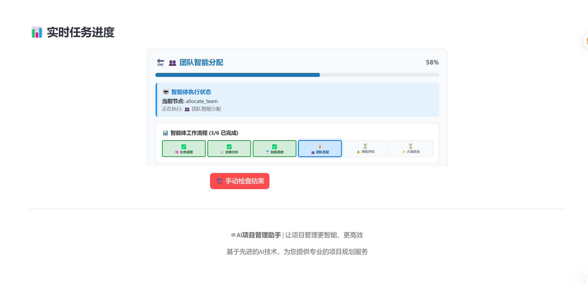
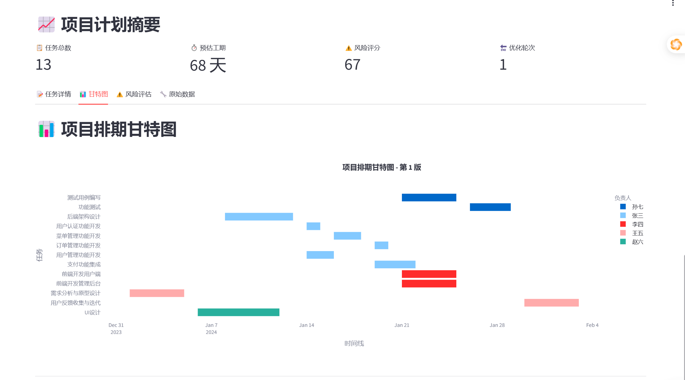

# Project Manager AI Assistant

<div align="center">

[](https://github.com/your-username/project-manager-assistant)
[](https://opensource.org/licenses/MIT)
[](https://www.python.org/downloads/)
[](https://github.com/psf/black)
[](http://makeapullrequest.com)
[](https://github.com/your-username/project-manager-assistant/graphs/contributors)

**Your intelligent co-pilot for seamless project planning and execution**

[English](#english) | [中文](#中文)

</div>

---

<div align="center">
  
  <p><em>Project Manager AI Assistant - Clean and intuitive interface</em></p>
</div>

---

## 📋 Table of Contents

- [English](#english)
  - [✨ Features](#-features)
  - [🚀 Quick Start](#-quick-start)
  - [📖 Documentation](#-documentation)
  - [🛠️ Architecture](#️-architecture)
  - [🤝 Contributing](#-contributing)
  - [📄 License](#-license)
- [中文](#中文)
  - [✨ 功能特性](#-功能特性)
  - [🚀 快速开始](#-快速开始)
  - [📖 文档](#-文档)
  - [🛠️ 架构设计](#️-架构设计)
  - [🤝 贡献指南](#-贡献指南)
  - [📄 许可证](#-许可证)

---

# English

> **Project Manager AI Assistant** leverages Large Language Models (LLMs) to transform simple project descriptions into comprehensive, actionable plans with tasks, dependencies, schedules, and risk assessments.

## ✨ Features

- **🤖 AI-Powered Task Generation**: Automatically decomposes high-level project goals into detailed, granular tasks
- **🔗 Automated Dependency Analysis**: Intelligently identifies and maps dependencies between tasks
- **📊 Dynamic Gantt Chart Visualization**: Generates interactive Gantt charts for clear project timeline views
- **👥 Team-Aware Planning**: Allocates tasks based on real team members' skills and profiles
- **⚠️ Proactive Risk Assessment**: Identifies potential risks and suggests mitigation strategies
- **🔌 Pluggable Architecture**: Easily extend with new integrations (Jira, Asana, Slack) without touching core logic
- **📈 Real-time Progress Tracking**: Monitor project progress with live updates and notifications
- **🎯 Smart Resource Allocation**: Optimize team workload distribution based on skills and availability

## 📸 Application Screenshots

<div align="center">
  <table>
    <tr>
      <td align="center">
        
        <br/><strong>主界面 / Main Interface</strong>
        <br/>项目描述和团队信息输入界面
      </td>
      <td align="center">
        
        <br/><strong>处理进度 / Processing Progress</strong>
        <br/>AI分析项目的实时进度显示
      </td>
    </tr>
    <tr>
      <td align="center">
        
        <br/><strong>项目计划结果 / Project Plan Results</strong>
        <br/>生成的详细项目计划和任务分解
      </td>
      <td align="center">
        
        <br/><strong>甘特图 / Gantt Chart</strong>
        <br/>可视化的项目时间线和依赖关系
      </td>
    </tr>
  </table>
</div>

## 🚀 Quick Start

### Prerequisites

- Python 3.9+
- OpenAI API Key
- Git

### Installation

1. **Clone the repository**
   ```bash
   git clone https://github.com/your-username/project-manager-assistant.git
   cd project-manager-assistant
   ```

2. **Set up virtual environment**
   ```bash
   python -m venv venv
   source venv/bin/activate  # On Windows: venv\Scripts\activate
   ```

3. **Install dependencies**
   ```bash
   pip install -r requirements.txt
   ```

4. **Configure environment**
   ```bash
   cp .env.example .env
   # Edit .env and add your OpenAI API key
   # OPENAI_API_KEY="sk-..."
   ```

5. **Run the application**
   ```bash
   # Start backend (FastAPI)
   uvicorn app.main:app --reload --host 0.0.0.0 --port 8000
   
   # Start frontend (Streamlit) - in a new terminal
   streamlit run streamlit_app/app.py --server.port 8501
   ```

6. **Access the application**
   - Frontend: http://localhost:8501
   - API Documentation: http://localhost:8000/docs

### Project Input Example

<div align="center">
  
  <p><em>Simply provide a project description and your team's profile</em></p>
</div>

## 📖 Documentation

- **[User Guide](docs/user-guide.md)** - Complete guide to using the application
- **[API Reference](docs/api-reference.md)** - Detailed API documentation
- **[Architecture Guide](docs/architecture.md)** - System design and technical details
- **[Plugin Development](docs/plugin-development.md)** - How to create custom plugins
- **[Deployment Guide](docs/deployment.md)** - Production deployment instructions

## 🛠️ Architecture

This project is built on a powerful **LangGraph**-powered pluggable architecture:

```
project-manager-assistant/
├── app/                    # Backend API (FastAPI)
│   ├── main.py            # Application entry point
│   ├── models/            # Data models
│   ├── services/          # Business logic
│   └── plugins/           # Integration plugins
├── streamlit_app/         # Frontend UI (Streamlit)
│   ├── app.py            # Main application
│   ├── components/       # UI components
│   └── pages/           # Application pages
├── docs/                 # Documentation
├── tests/               # Test suite
└── requirements.txt     # Python dependencies
```

### Core Components

- **Core Engine**: Sophisticated agentic workflow for planning, analysis, and optimization
- **Plugin System**: Independent integrations for external tools (Jira, Asana, Slack)
- **API Layer**: RESTful API for programmatic access
- **UI Layer**: Streamlit-based interactive interface

## 🤝 Contributing

We welcome contributions from the community! Here's how you can help:

### Ways to Contribute

- 🐛 **Report Bugs**: Use our [issue tracker](https://github.com/your-username/project-manager-assistant/issues)
- 💡 **Request Features**: Submit feature requests via issues
- 🔧 **Fix Issues**: Pick up issues labeled "good first issue"
- 📝 **Improve Documentation**: Help make our docs better
- 🔌 **Create Plugins**: Develop new integrations
- 🧪 **Write Tests**: Improve our test coverage

### Development Setup

1. Fork the repository
2. Create a feature branch: `git checkout -b feature/amazing-feature`
3. Make your changes and add tests
4. Run tests: `pytest`
5. Commit your changes: `git commit -m 'Add amazing feature'`
6. Push to the branch: `git push origin feature/amazing-feature`
7. Open a Pull Request

### Code Style

- Follow [PEP 8](https://www.python.org/dev/peps/pep-0008/) for Python code
- Use [Black](https://black.readthedocs.io/) for code formatting
- Write comprehensive tests for new features
- Update documentation for any API changes

For more details, see our **[Contributing Guide](CONTRIBUTING.md)**.

## 📄 License

This project is licensed under the MIT License - see the [LICENSE](LICENSE) file for details.

---

# 中文

> **项目管理AI助手** 利用大型语言模型（LLM），将简单的项目描述转化为包含任务、依赖关系、时间安排和风险评估的全面可执行计划。

## ✨ 功能特性

- **🤖 AI智能任务生成**: 自动将高层级项目目标分解为详细的具体任务
- **🔗 自动化依赖分析**: 智能识别并映射任务间的依赖关系
- **📊 动态甘特图可视化**: 生成交互式甘特图，清晰展示项目时间线
- **👥 感知团队的规划**: 基于真实团队成员的技能画像进行任务分配
- **⚠️ 前瞻性风险评估**: 识别潜在风险并提出缓解策略
- **🔌 插件化架构**: 无需修改核心代码即可轻松扩展新集成（Jira、Asana、Slack）
- **📈 实时进度跟踪**: 通过实时更新和通知监控项目进度
- **🎯 智能资源分配**: 基于技能和可用性优化团队工作负载分配

## 📸 应用截图

<div align="center">
  <table>
    <tr>
      <td align="center">
        
        <br/><strong>主界面</strong>
        <br/>简洁直观的项目描述和团队信息输入界面
      </td>
      <td align="center">
        
        <br/><strong>处理进度</strong>
        <br/>AI智能分析项目的实时进度展示
      </td>
    </tr>
    <tr>
      <td align="center">
        
        <br/><strong>项目计划结果</strong>
        <br/>AI生成的详细项目计划和任务分解
      </td>
      <td align="center">
        
        <br/><strong>甘特图</strong>
        <br/>可视化的项目时间线和任务依赖关系
      </td>
    </tr>
  </table>
</div>

## 🚀 快速开始

### 前置要求

- Python 3.9+
- OpenAI API 密钥
- Git

### 安装步骤

1. **克隆代码仓库**
   ```bash
   git clone https://github.com/your-username/project-manager-assistant.git
   cd project-manager-assistant
   ```

2. **设置虚拟环境**
   ```bash
   python -m venv venv
   source venv/bin/activate  # Windows系统: venv\Scripts\activate
   ```

3. **安装依赖**
   ```bash
   pip install -r requirements.txt
   ```

4. **配置环境变量**
   ```bash
   cp .env.example .env
   # 编辑 .env 文件并添加您的 OpenAI API 密钥
   # OPENAI_API_KEY="sk-..."
   ```

5. **运行应用**
   ```bash
   # 启动后端 (FastAPI)
   uvicorn app.main:app --reload --host 0.0.0.0 --port 8000
   
   # 启动前端 (Streamlit) - 在新的终端中
   streamlit run streamlit_app/app.py --server.port 8501
   ```

6. **访问应用**
   - 前端界面: http://localhost:8501
   - API文档: http://localhost:8000/docs

### 项目输入示例

<div align="center">
  
  <p><em>您只需提供项目描述和团队成员简介</em></p>
</div>

## 📖 文档

- **[用户指南](docs/user-guide.md)** - 完整的使用指南
- **[API参考](docs/api-reference.md)** - 详细的API文档
- **[架构指南](docs/architecture.md)** - 系统设计和技术细节
- **[插件开发](docs/plugin-development.md)** - 如何创建自定义插件
- **[部署指南](docs/deployment.md)** - 生产环境部署说明

## 🛠️ 架构设计

本项目构建于强大的 **LangGraph** 驱动的插件化架构之上：

```
project-manager-assistant/
├── app/                    # 后端API (FastAPI)
│   ├── main.py            # 应用入口点
│   ├── models/            # 数据模型
│   ├── services/          # 业务逻辑
│   └── plugins/           # 集成插件
├── streamlit_app/         # 前端界面 (Streamlit)
│   ├── app.py            # 主应用
│   ├── components/       # UI组件
│   └── pages/           # 应用页面
├── docs/                 # 文档
├── tests/               # 测试套件
└── requirements.txt     # Python依赖
```

### 核心组件

- **核心引擎**: 复杂的智能工作流，负责规划、分析和优化
- **插件系统**: 外部工具的独立集成（Jira、Asana、Slack）
- **API层**: 提供程序化访问的RESTful API
- **UI层**: 基于Streamlit的交互式界面

## 🤝 贡献指南

我们欢迎社区贡献！以下是您可以帮助的方式：

### 贡献方式

- 🐛 **报告Bug**: 使用我们的[问题跟踪器](https://github.com/your-username/project-manager-assistant/issues)
- 💡 **请求功能**: 通过issues提交功能请求
- 🔧 **修复问题**: 处理标记为"good first issue"的问题
- 📝 **改进文档**: 帮助改进我们的文档
- 🔌 **创建插件**: 开发新的集成
- 🧪 **编写测试**: 提高测试覆盖率

### 开发环境设置

1. Fork代码仓库
2. 创建功能分支: `git checkout -b feature/amazing-feature`
3. 进行更改并添加测试
4. 运行测试: `pytest`
5. 提交更改: `git commit -m 'Add amazing feature'`
6. 推送到分支: `git push origin feature/amazing-feature`
7. 创建Pull Request

### 代码规范

- Python代码遵循 [PEP 8](https://www.python.org/dev/peps/pep-0008/)
- 使用 [Black](https://black.readthedocs.io/) 进行代码格式化
- 为新功能编写全面的测试
- 任何API更改都要更新文档

更多详细信息，请参阅我们的 **[贡献指南](CONTRIBUTING.md)**。

## 📄 许可证

本项目采用MIT许可证 - 详情请参阅 [LICENSE](LICENSE) 文件。

---

<div align="center">

**Made with ❤️ by the Project Manager AI Assistant Team**

[](https://github.com/your-username/project-manager-assistant)
[](https://github.com/your-username/project-manager-assistant)
[](https://github.com/your-username/project-manager-assistant/issues)

</div>
