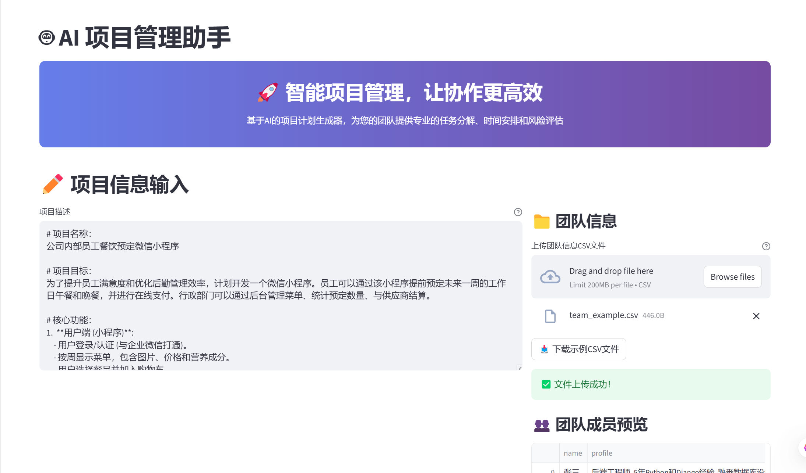
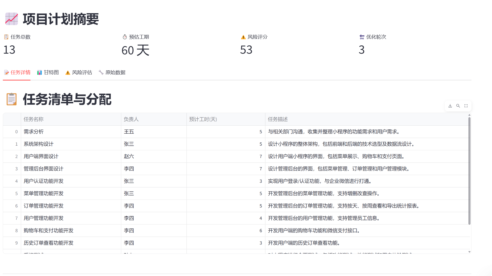

# User Guide

## Overview

The Project Manager AI Assistant is designed to help you create comprehensive project plans using AI. This guide will walk you through how to use the application effectively.

## Getting Started

### 1. Access the Application

1. Start the backend server:
   ```bash
   uvicorn app.main:app --reload --host 0.0.0.0 --port 8000
   ```

2. Start the frontend application:
   ```bash
   streamlit run streamlit_app/app.py --server.port 8501
   ```

3. Open your browser and navigate to `http://localhost:8501`

### 2. Configure Your Environment

Before using the application, make sure you have:

- A valid OpenAI API key configured in your `.env` file
- All dependencies installed (`pip install -r requirements.txt`)

## Application Interface Overview

<div align="center">
  <table>
    <tr>
      <td align="center">
        
        <br/><strong>Main Interface</strong>
        <br/>Clean and intuitive project input interface
      </td>
      <td align="center">
        
        <br/><strong>Processing Progress</strong>
        <br/>Real-time AI analysis with progress indicators
      </td>
    </tr>
    <tr>
      <td align="center">
        
        <br/><strong>Generated Project Plan</strong>
        <br/>Comprehensive task breakdown and resource allocation
      </td>
      <td align="center">
        
        <br/><strong>Interactive Gantt Chart</strong>
        <br/>Visual timeline with task dependencies
      </td>
    </tr>
  </table>
</div>

## Using the Application

### Step 1: Project Description

Enter a detailed description of your project. Include:

- Project goals and objectives
- Key deliverables
- Timeline constraints
- Budget considerations
- Any specific requirements or constraints

**Example:**
```
We need to develop a new e-commerce website for a local bookstore. 
The website should include user registration, product catalog, shopping cart, 
payment processing, and admin panel. The project should be completed within 
3 months with a budget of $50,000. We have a team of 5 developers with 
varying experience levels.
```

### Step 2: Team Information

Provide information about your team members:

- Name and role
- Skills and expertise
- Availability (hours per week)
- Experience level

**Example:**
```
John Smith - Senior Full-Stack Developer
- Skills: React, Node.js, Python, AWS
- Availability: 40 hours/week
- Experience: 8 years

Sarah Johnson - UI/UX Designer
- Skills: Figma, Adobe Creative Suite, User Research
- Availability: 30 hours/week
- Experience: 5 years
```

### Step 3: Generate Project Plan

Click the "Generate Plan" button to create your project plan. The AI will:

1. Break down your project into tasks
2. Identify dependencies between tasks
3. Allocate tasks to team members
4. Create a timeline
5. Assess potential risks

### Step 4: Review and Refine

Review the generated plan and make any necessary adjustments:

- Modify task assignments
- Adjust timelines
- Add or remove tasks
- Update dependencies

## Understanding the Output

### Task Breakdown

The AI generates a hierarchical task structure:

- **Epics**: High-level project phases
- **Stories**: User stories or feature requirements
- **Tasks**: Specific work items
- **Subtasks**: Detailed implementation steps

### Dependencies

Dependencies are automatically identified and visualized:

- **Finish-to-Start**: Task B cannot start until Task A is complete
- **Start-to-Start**: Task B can start when Task A starts
- **Finish-to-Finish**: Task B must finish when Task A finishes

### Timeline

The application generates:

- **Gantt Chart**: Visual timeline with task bars
- **Critical Path**: Longest sequence of dependent tasks
- **Milestones**: Key project checkpoints

### Risk Assessment

The AI identifies potential risks:

- **Technical Risks**: Technology challenges
- **Schedule Risks**: Timeline delays
- **Resource Risks**: Team availability issues
- **Budget Risks**: Cost overruns

## Advanced Features

### Custom Templates

Create reusable project templates for common project types:

1. Go to Templates section
2. Create a new template
3. Define standard tasks and dependencies
4. Save for future use

### Export Options

Export your project plan in various formats:

- **PDF**: For presentations and reports
- **Excel**: For detailed analysis
- **Jira**: For integration with Jira
- **MS Project**: For Microsoft Project users

### Integration with External Tools

Connect with popular project management tools:

- **Jira**: Sync tasks and issues
- **Asana**: Export project structure
- **Slack**: Send notifications
- **GitHub**: Link to repositories

## Troubleshooting

### Common Issues

**Q: The AI is not generating a plan**
A: Check your OpenAI API key and ensure you have sufficient credits.

**Q: The plan seems unrealistic**
A: Try providing more detailed project information and team constraints.

**Q: Tasks are not properly assigned**
A: Review your team member skills and availability information.

### Getting Help

- Check the [API Reference](api-reference.md) for technical details
- Review the [Architecture Guide](architecture.md) for system understanding
- Create an issue on GitHub for bugs or feature requests

## Best Practices

### Writing Project Descriptions

- Be specific about goals and deliverables
- Include realistic constraints
- Mention any special requirements
- Provide context about the business domain

### Team Information

- Be honest about skill levels
- Include relevant experience
- Specify actual availability
- Mention any preferences or constraints

### Plan Review

- Validate task dependencies
- Check resource allocation
- Review timeline feasibility
- Assess risk mitigation strategies

## Tips for Success

1. **Start with a clear vision**: The better your project description, the better the plan
2. **Be realistic about constraints**: Include actual limitations and deadlines
3. **Review and iterate**: Use the generated plan as a starting point
4. **Keep it updated**: Revisit the plan as the project evolves
5. **Leverage the team**: Use team member expertise to refine the plan

---

*For technical questions or advanced usage, please refer to the [API Reference](api-reference.md) or [Architecture Guide](architecture.md).* 